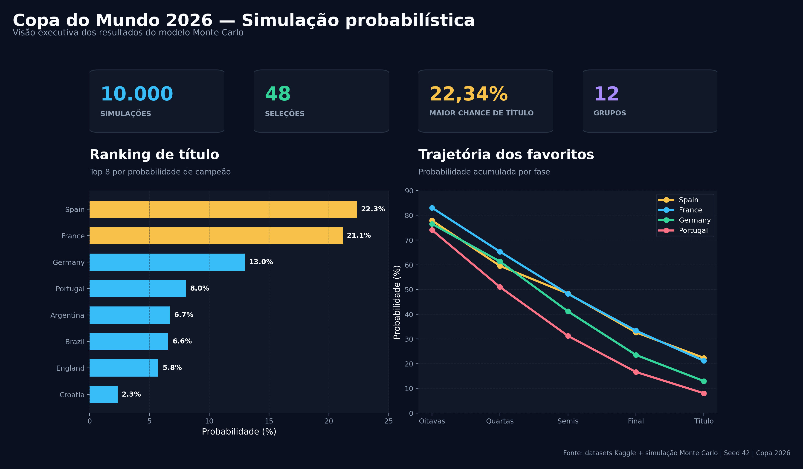
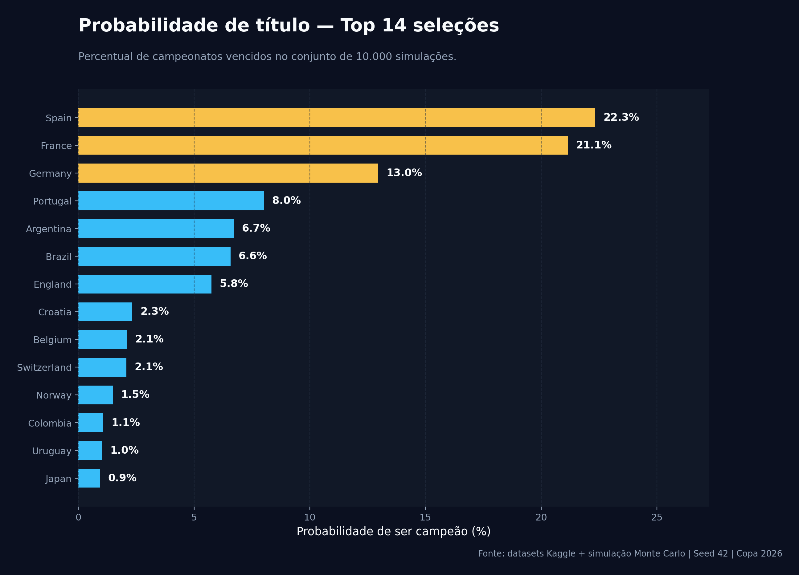
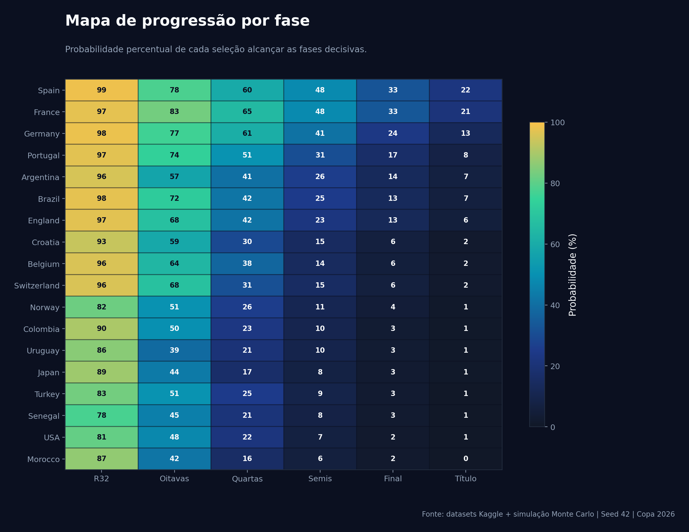
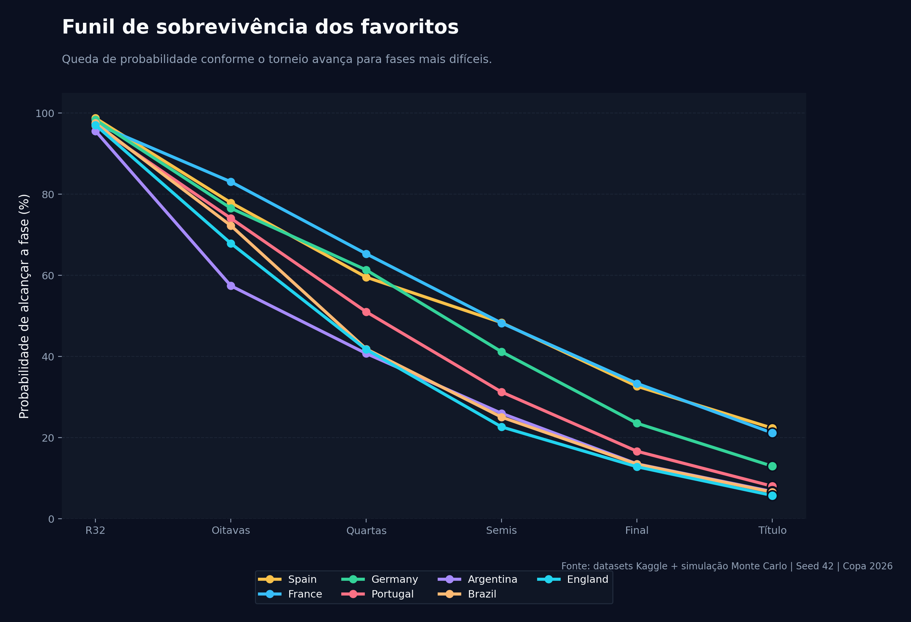
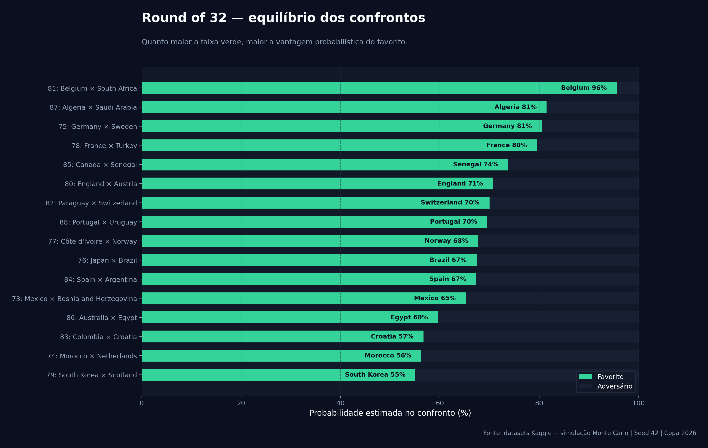

# Copa 2026 Predictor

<p align="center">
  
</p>

<p align="center">
  <b>Pipeline analítico para estimar probabilidades da Copa do Mundo FIFA 2026 usando dados esportivos, força técnica das seleções e simulação Monte Carlo.</b>
</p>

<p align="center">
  
  
  
  
  
</p>

---

## Visão geral

Este repositório apresenta um projeto completo de análise preditiva para a Copa do Mundo de 2026. A solução combina dados públicos, engenharia de atributos e simulação probabilística para estimar o desempenho esperado das 48 seleções no novo formato do torneio.

O projeto foi estruturado para ser auditável e reprodutível: os dados brutos ficam separados das bases processadas, os notebooks documentam a análise e os scripts em `tools/` permitem regenerar os principais artefatos.

---

## Objetivos analíticos

O modelo estima:

- probabilidade de classificação para o mata-mata;
- probabilidade de avanço para oitavas, quartas, semifinais e final;
- probabilidade de título por seleção;
- favoritos por confronto no Round of 32;
- distribuição dos campeões em múltiplas simulações;
- impacto da força técnica do elenco no desempenho esperado.

---

## Resultados principais

### Ranking de probabilidade de título

<p align="center">
  
</p>

| Rank | Seleção | Título | Final | Semifinal |
|---:|---|---:|---:|---:|
| 1 | Espanha | 22,34% | 32,66% | 48,34% |
| 2 | França | 21,15% | 33,36% | 48,24% |
| 3 | Alemanha | 12,96% | 23,54% | 41,16% |
| 4 | Portugal | 8,03% | 16,64% | 31,24% |
| 5 | Argentina | 6,71% | 13,53% | 25,99% |
| 6 | Brasil | 6,57% | 13,47% | 25,04% |
| 7 | Inglaterra | 5,75% | 12,82% | 22,64% |
| 8 | Croácia | 2,33% | 6,45% | 14,61% |
| 9 | Bélgica | 2,10% | 5,66% | 14,38% |
| 10 | Suíça | 2,07% | 6,01% | 14,95% |

---

### Progressão por fase

<p align="center">
  
</p>

O heatmap resume a probabilidade de cada seleção atingir as fases decisivas. Ele ajuda a separar seleções que têm alto potencial de título de seleções que são consistentes para avançar, mas perdem força nas rodadas finais.

---

### Funil dos favoritos

<p align="center">
  
</p>

O funil mostra como a probabilidade dos principais favoritos diminui à medida que o torneio avança. Essa visualização é útil para comparar risco acumulado entre seleções de elite.

---

### Round of 32: equilíbrio dos confrontos

<p align="center">
  
</p>

A visualização acima destaca quais confrontos simulados têm favorito claro e quais tendem a ser mais equilibrados.

---

## Metodologia

A simulação usa uma medida composta de força por seleção. Essa força é construída a partir de diferentes dimensões de dados:

- histórico e rating Elo;
- probabilidades e fixtures de bases externas;
- ratings de jogadores do EA Sports FC 26;
- estatísticas complementares do EA Sports FC 25;
- força do elenco por setor: ataque, meio, defesa e goleiros;
- valor de mercado e indicadores de experiência;
- ajuste para confrontos intercontinentais com pouco histórico direto.

A partir dessa força relativa, o projeto simula partidas, fase de grupos, classificação de melhores terceiros, chaveamento e mata-mata. O resultado final não é uma previsão determinística, mas uma distribuição de probabilidades.

---

## Dados utilizados

As bases foram organizadas a partir de datasets públicos do Kaggle:

| Fonte | Uso no projeto |
|---|---|
| `justdhia/ea-sports-fc-26-player-ratings` | Qualidade individual e setorial dos elencos |
| `afonsofernandescruz/2026-fifa-world-cup-historical-elo-ratings` | Rating Elo histórico das seleções |
| `samandarabdujabbar/ea-sports-fc-25-complete-player-stats-and-analysis` | Estatísticas complementares e valor de mercado |
| `pranishkessi/fifa-world-cup-2026-prediction-simulator` | Grupos, fixtures, slots de chaveamento e probabilidades de referência |

Mais detalhes sobre os dados estão em `Data/README.md`.

---

## Estrutura do repositório

```text
.
├── Data/
│   ├── raw/kaggle/                       # Datasets brutos
│   ├── processed/                        # Bases tratadas e consolidadas
│   ├── dataset_manifest.json             # Manifesto dos dados usados
│   └── README.md                         # Documentação das fontes
├── outputs/                              # Tabelas, relatórios e gráficos gerados
├── tests/                                # Testes automatizados
├── tools/                                # Scripts de pipeline e visualização
├── Copa_2026_Data_Pipeline_e_Simulacao.ipynb
├── Vencedor_Copa_2026_Notebook.ipynb     # Notebook principal
└── README.md
```

---

## Arquivos relevantes

| Arquivo | Descrição |
|---|---|
| `Vencedor_Copa_2026_Notebook.ipynb` | Notebook principal da análise e simulação |
| `Copa_2026_Data_Pipeline_e_Simulacao.ipynb` | Notebook de ingestão e preparação de dados |
| `tools/build_copa_2026_data_pipeline.py` | Script de construção da base processada |
| `tools/update_vencedor_copa_notebook.py` | Script para atualizar notebook e outputs finais |
| `tools/create_professional_readme_charts.py` | Script que gera os gráficos profissionais do README |
| `Data/processed/copa_2026_master_team_dataset.csv` | Base consolidada por seleção |
| `outputs/updated_2026_probabilities.csv` | Probabilidades finais por seleção |
| `outputs/updated_round_of_32_bracket.csv` | Confrontos e probabilidades do Round of 32 |

---

## Como executar

Clone o repositório:

```bash
git clone https://github.com/brieueu/Copa_2026.git
cd Copa_2026
```

Crie e ative um ambiente virtual:

```bash
python -m venv .venv
source .venv/bin/activate
```

Instale as dependências principais:

```bash
pip install pandas numpy matplotlib openpyxl pytest
```

Execute os testes:

```bash
python -m pytest -q
```

Regere os gráficos profissionais do README:

```bash
python tools/create_professional_readme_charts.py
```

---

## Estado atual da simulação

| Item | Valor |
|---|---:|
| Seleções | 48 |
| Grupos | 12 |
| Simulações Monte Carlo | 10.000 |
| Seed | 42 |
| Formato | 12 grupos de 4 + mata-mata com 32 seleções |
| Testes | Passing |

---

## Limitações

Este projeto deve ser interpretado como uma análise probabilística baseada nos dados disponíveis, não como previsão oficial do torneio.

As probabilidades podem mudar com:

- convocações definitivas;
- lesões;
- forma recente das seleções;
- amistosos e eliminatórias próximos ao torneio;
- alterações oficiais no chaveamento;
- atualização dos ratings e bases externas.

---

## Conclusão

O modelo aponta Espanha, França e Alemanha como o primeiro grupo de favoritos, com Portugal, Argentina, Brasil e Inglaterra formando uma segunda camada competitiva. A principal contribuição do projeto é transformar diferentes fontes de dados esportivos em uma visão probabilística clara, visual e reprodutível para a Copa do Mundo de 2026.
