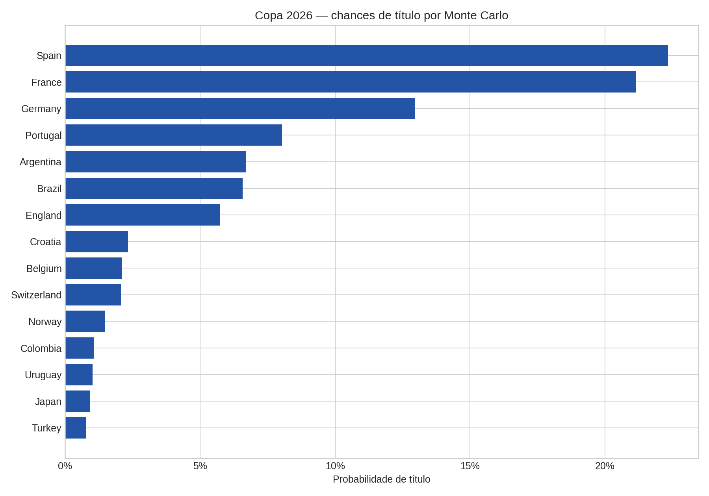
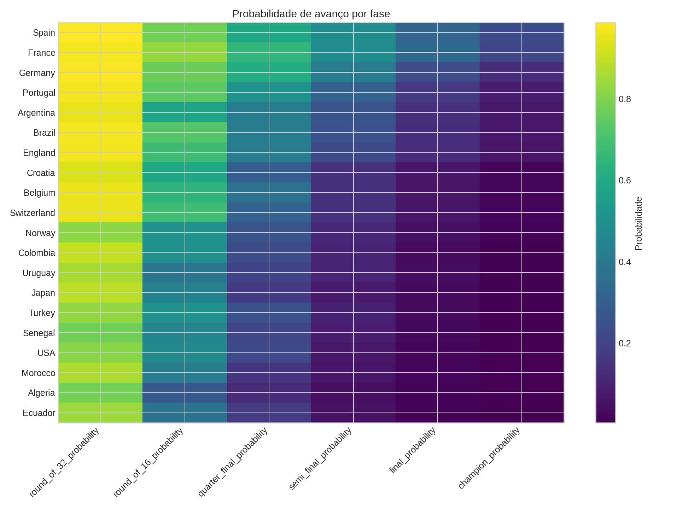
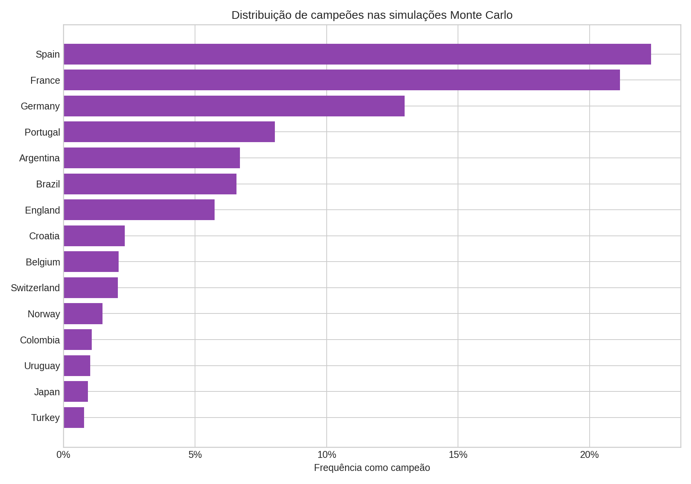
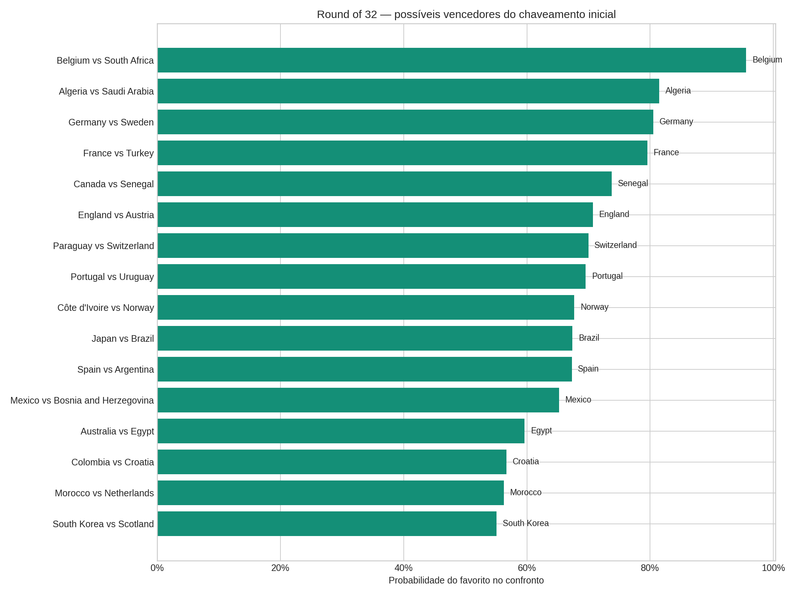

# 🏆 Previsor da Copa do Mundo 2026

<p align="center">
  
</p>

<p align="center">
  <b>Pipeline de dados + simulação Monte Carlo para estimar probabilidades da Copa do Mundo FIFA 2026.</b>
</p>

<p align="center">
  
  
  
  
</p>

---

## 📌 Sobre o projeto

Este projeto constrói uma base combinada de seleções da Copa de 2026, integra dados de diferentes fontes e executa uma simulação probabilística do torneio.

O objetivo é estimar:

- probabilidade de cada seleção ser campeã;
- probabilidade de chegar à final, semifinal e fases anteriores;
- desempenho esperado na fase de grupos;
- possíveis confrontos do mata-mata;
- distribuição dos campeões em múltiplas simulações.

A simulação considera o novo formato da Copa de 2026:

- 48 seleções;
- 12 grupos de 4 equipes;
- 32 seleções classificadas para o mata-mata;
- simulação com seed fixa para reprodutibilidade.

---

## 📊 Principais resultados

### Favoritos ao título

<p align="center">
  
</p>

Segundo a simulação atualizada, as maiores probabilidades de título foram:

| Posição | Seleção | Probabilidade de título |
|---:|---|---:|
| 1 | Espanha | 22,34% |
| 2 | França | 21,15% |
| 3 | Alemanha | 12,96% |
| 4 | Portugal | 8,03% |
| 5 | Argentina | 6,71% |
| 6 | Brasil | 6,57% |
| 7 | Inglaterra | 5,75% |
| 8 | Croácia | 2,33% |
| 9 | Bélgica | 2,10% |
| 10 | Suíça | 2,07% |

---

## 🔥 Progressão por fase

<p align="center">
  
</p>

O heatmap mostra a chance de cada seleção alcançar as fases avançadas do torneio, permitindo comparar consistência e risco entre seleções favoritas e intermediárias.

---

## 🎲 Distribuição Monte Carlo dos campeões

<p align="center">
  
</p>

A distribuição Monte Carlo mostra quantas vezes cada seleção terminou campeã nas simulações executadas.

---

## ⚔️ Probabilidades no Round of 32

<p align="center">
  
</p>

Este gráfico resume os confrontos simulados da primeira rodada eliminatória e a probabilidade estimada para cada lado avançar.

---

## 🧠 Metodologia

A força estimada de cada seleção combina diferentes dimensões:

- Elo histórico;
- rankings e probabilidades de bases externas;
- ratings de jogadores do EA Sports FC 26;
- estatísticas do EA Sports FC 25;
- valor de mercado;
- indicadores ofensivos, defensivos e de goleiros;
- ajuste para confrontos intercontinentais com pouco histórico direto.

A simulação é probabilística: ela não tenta prever um único resultado fixo, mas sim estimar distribuições de probabilidade ao longo de milhares de cenários possíveis.

---

## 🗂️ Estrutura do projeto

```text
.
├── Data/
│   ├── raw/
│   │   └── kaggle/                      # Datasets originais baixados do Kaggle
│   ├── processed/                       # Bases tratadas e combinadas
│   ├── dataset_manifest.json
│   └── README.md
├── outputs/                             # Gráficos, tabelas e relatórios gerados
├── tests/                               # Testes automatizados
├── tools/                               # Scripts auxiliares do pipeline
├── Copa_2026_Data_Pipeline_e_Simulacao.ipynb
├── Vencedor_Copa_2026_Notebook.ipynb    # Notebook principal
└── README.md
```

---

## 📁 Arquivos principais

| Arquivo | Descrição |
|---|---|
| `Vencedor_Copa_2026_Notebook.ipynb` | Notebook principal com a simulação atualizada |
| `Copa_2026_Data_Pipeline_e_Simulacao.ipynb` | Notebook de ingestão, auditoria e preparação dos dados |
| `tools/build_copa_2026_data_pipeline.py` | Script de construção da base processada |
| `tools/update_vencedor_copa_notebook.py` | Script de atualização do notebook e outputs finais |
| `Data/processed/copa_2026_master_team_dataset.csv` | Base consolidada por seleção |
| `outputs/updated_2026_probabilities.csv` | Probabilidades finais por seleção |
| `outputs/updated_2026_simulation_summary.md` | Resumo textual da simulação |
| `outputs/updated_model_card.md` | Cartão metodológico do modelo |

---

## ▶️ Como executar

1. Clone o repositório:

```bash
git clone https://github.com/brieueu/Copa_2026.git
cd Copa_2026
```

2. Crie e ative um ambiente virtual:

```bash
python -m venv .venv
source .venv/bin/activate
```

3. Instale as dependências usadas no pipeline:

```bash
pip install pandas numpy matplotlib seaborn openpyxl pytest
```

4. Execute os testes:

```bash
python -m pytest -q
```

Resultado esperado neste estado do projeto:

```text
1 passed
```

---

## 📚 Fontes de dados

Os dados foram organizados a partir de bases públicas do Kaggle:

- `justdhia/ea-sports-fc-26-player-ratings`
- `afonsofernandescruz/2026-fifa-world-cup-historical-elo-ratings`
- `samandarabdujabbar/ea-sports-fc-25-complete-player-stats-and-analysis`
- `pranishkessi/fifa-world-cup-2026-prediction-simulator`

Mais detalhes estão em:

```text
Data/README.md
```

---

## ⚠️ Limitações

Esta previsão não representa resultado oficial.

As probabilidades podem mudar com:

- convocações definitivas;
- lesões;
- forma recente das seleções;
- alterações no chaveamento oficial;
- novas partidas antes da Copa;
- mudanças nos ratings e rankings utilizados.

O modelo deve ser interpretado como uma simulação estatística baseada nos dados disponíveis, não como uma certeza esportiva.

---

## ✅ Estado atual

- Simulações executadas: `10000`
- Seed: `42`
- Seleções: `48`
- Formato: `12 grupos de 4 + mata-mata com 32 seleções`
- Testes automatizados: `1 passed`

---

<p align="center">
  Feito para análise probabilística da Copa do Mundo 2026 ⚽
</p>
