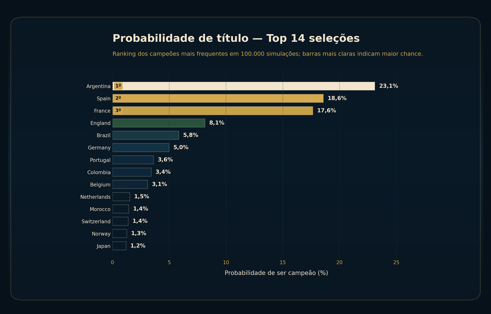
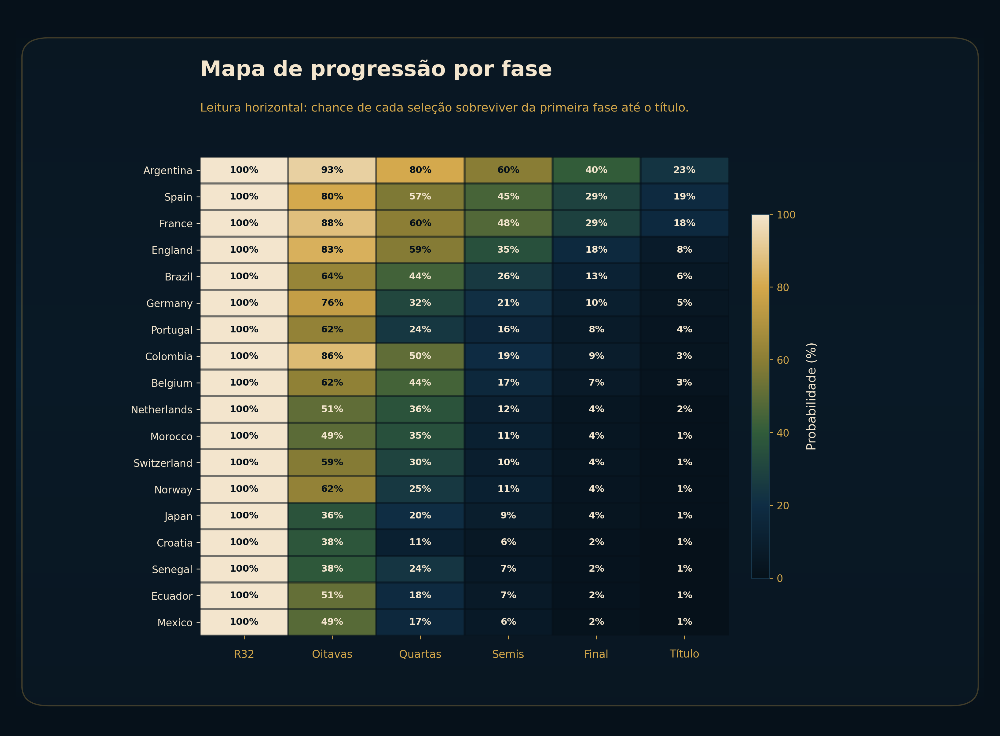
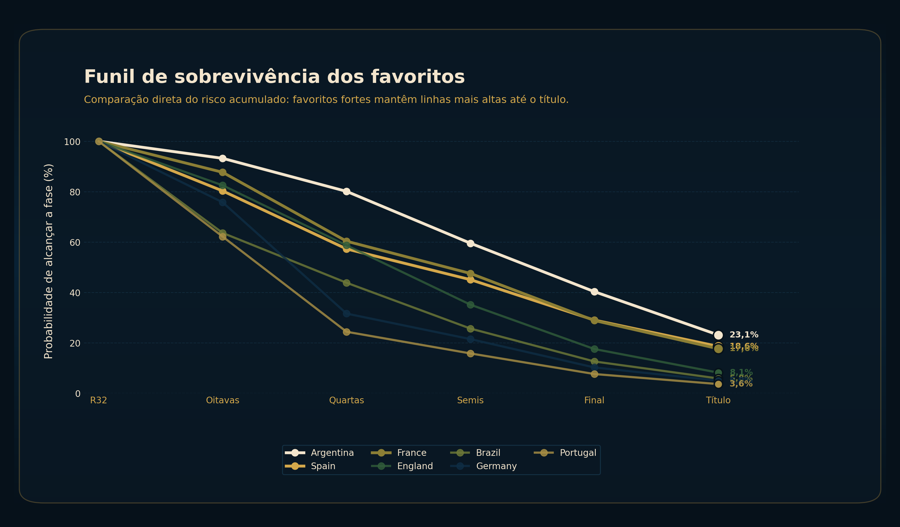
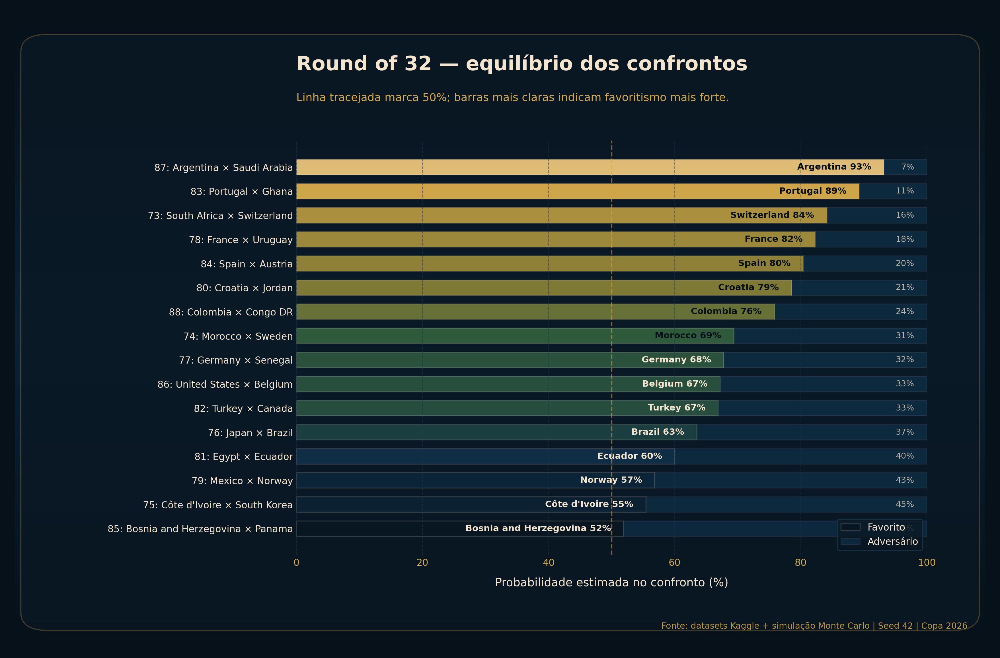
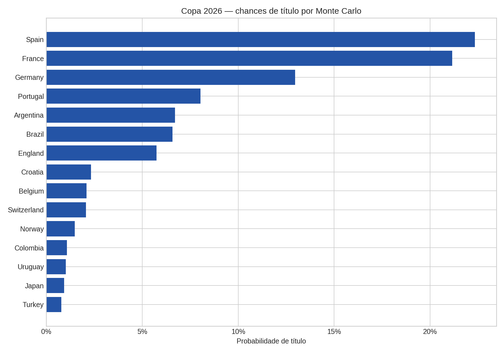
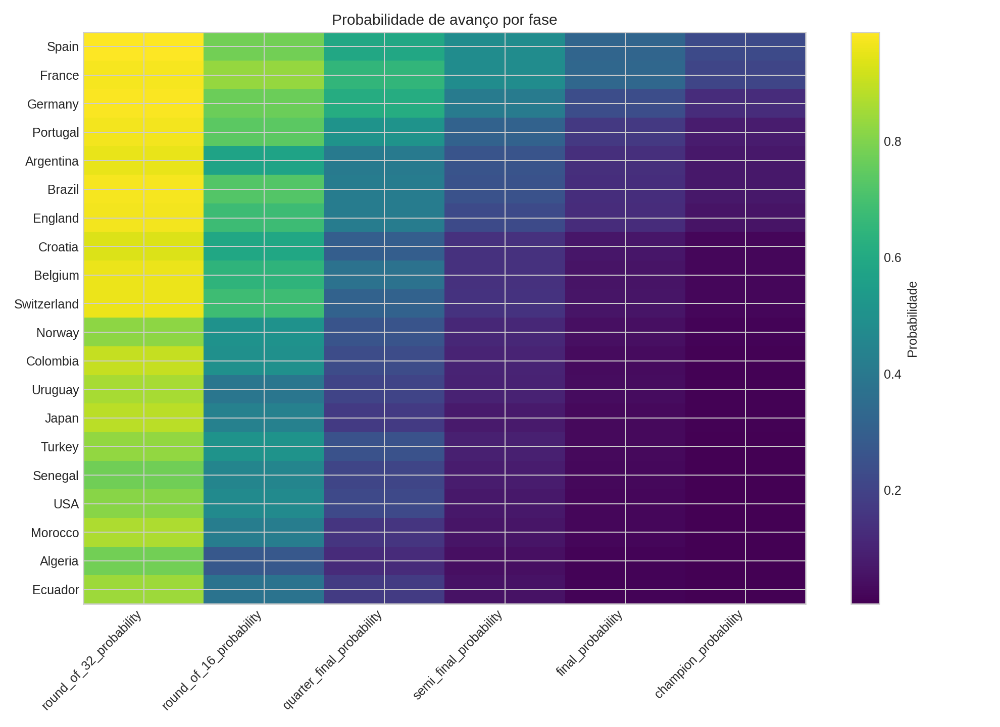
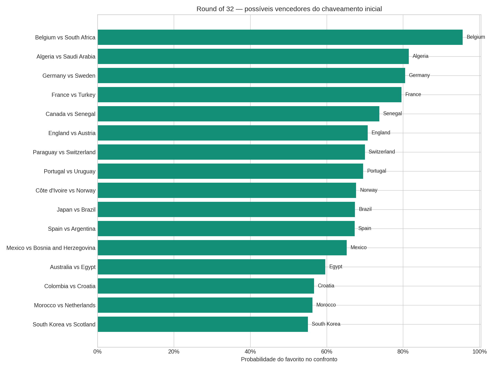
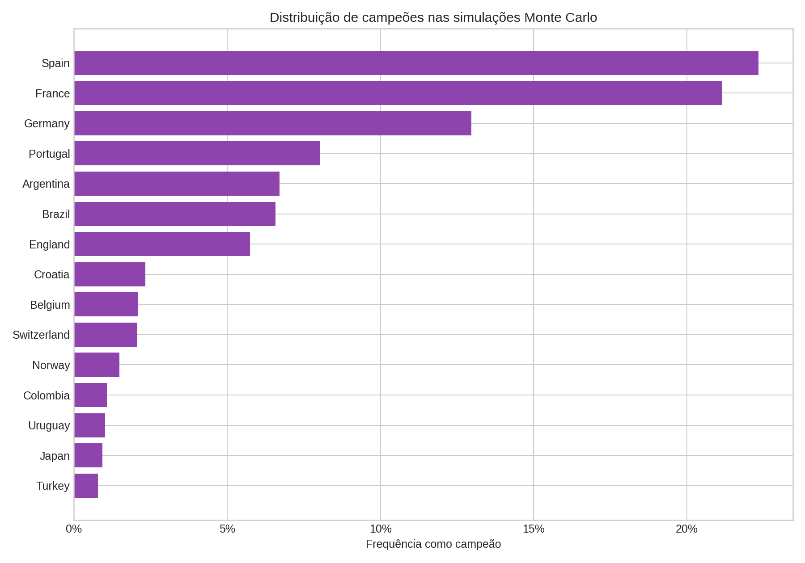

# Copa 2026 Predictor

<p align="center">
  
</p>

<p align="center">
  <b>Pipeline analítico para estimar probabilidades da Copa do Mundo FIFA 2026 usando Elo dinâmico, forma recente, sede/local, pênaltis e simulação Monte Carlo.</b>
</p>

<p align="center">
  
  
  
  
  
</p>

---

## Visão geral

Este repositório apresenta um projeto completo de análise preditiva para a Copa do Mundo de 2026. A versão `v0.2.0` combina dados públicos, resultados reais da fase de grupos, engenharia de atributos e simulação probabilística para estimar o desempenho esperado das 48 seleções no novo formato do torneio.

O projeto foi estruturado para ser auditável e reprodutível: os dados brutos ficam separados das bases processadas, os notebooks documentam a análise e os scripts em `tools/` permitem regenerar os principais artefatos.

---

## Objetivos analíticos

O modelo estima:

- probabilidade de classificação para o mata-mata;
- probabilidade de avanço para oitavas, quartas, semifinais e final;
- probabilidade de título por seleção;
- favoritos por confronto no Round of 32;
- distribuição dos campeões em múltiplas simulações;
- impacto da força técnica do elenco no desempenho esperado.

---

## Resultados principais

### Ranking de probabilidade de título

<p align="center">
  
</p>

| Rank | Seleção | Título | Final | Semifinal |
|---:|---|---:|---:|---:|
| 1 | Argentina | 23,11% | 40,29% | 59,51% |
| 2 | Espanha | 18,57% | 29,00% | 45,06% |
| 3 | França | 17,65% | 28,84% | 47,52% |
| 4 | Inglaterra | 8,15% | 17,52% | 35,12% |
| 5 | Brasil | 5,83% | 12,58% | 25,64% |
| 6 | Alemanha | 4,98% | 10,21% | 21,45% |
| 7 | Portugal | 3,61% | 7,60% | 15,77% |
| 8 | Colômbia | 3,41% | 9,27% | 19,32% |
| 9 | Bélgica | 3,09% | 7,20% | 16,56% |
| 10 | Holanda | 1,52% | 4,21% | 11,67% |

---

### Progressão por fase

<p align="center">
  
</p>

O heatmap resume a probabilidade de cada seleção atingir as fases decisivas. Ele ajuda a separar seleções que têm alto potencial de título de seleções que são consistentes para avançar, mas perdem força nas rodadas finais.

---

### Funil dos favoritos

<p align="center">
  
</p>

O funil mostra como a probabilidade dos principais favoritos diminui à medida que o torneio avança. Essa visualização é útil para comparar risco acumulado entre seleções de elite.

---

### Round of 32: equilíbrio dos confrontos

<p align="center">
  
</p>

A visualização acima destaca quais confrontos do chaveamento real de 28/06 têm favorito claro e quais tendem a ser mais equilibrados.

---

### Artefatos visuais gerados

Além dos gráficos profissionais usados nas seções principais, o pipeline também gera visualizações complementares em `outputs/` para auditoria e comparação dos resultados.

<p align="center">
  
  
</p>

<p align="center">
  
  
</p>

---

## O que mudou na v0.2.0

- Elo dinâmico atualizado jogo a jogo com margem de vitória e peso de competição.
- Forma recente calculada a partir dos últimos 10 jogos e dos últimos 6 meses antes do torneio.
- Sede/local incorporados como vantagem Elo conservadora para país-sede e região.
- Mata-mata com separação explícita entre vitória em 90/120 minutos e disputa por pênaltis.
- Pesos auditáveis em `Data/processed/model_weights_v0.2.0.json`.
- Nova rodada Monte Carlo com `100.000` torneios e outputs regenerados.
- Chaveamento real do dia 28/06 usado no mata-mata a partir do Round of 32.

---

## Avaliação da v0.1.0 após a fase de grupos

A `v0.1.0` foi útil como linha de base: ela estruturou os dados, criou o pipeline Monte Carlo e gerou probabilidades claras para o formato de 48 seleções. Porém, depois que resultados reais entram no torneio, um modelo majoritariamente estático fica limitado.

### Sucessos da v0.1.0

- manteve favoritos fortes com alta probabilidade de avanço;
- comunicou incerteza em forma de distribuição, não como previsão determinística;
- organizou fixtures, grupos, melhores terceiros e chaveamento de forma reprodutível;
- ofereceu bons artefatos visuais para apresentação e revisão.

### Fracassos e limitações da v0.1.0

- rating estático demais para reagir a resultados reais;
- pouca sensibilidade a placares como goleadas;
- tendência a subestimar zebras e picos de forma recentes;
- pênaltis tratados indiretamente como vitória binária simples;
- sede/local com peso fraco e pouco documentado.

---

## Metodologia v0.2.0

A simulação usa uma medida composta de força por seleção. Essa força é construída a partir de diferentes dimensões de dados:

- Elo dinâmico pós-fase de grupos;
- probabilidades e fixtures de bases externas;
- ratings de jogadores do EA Sports FC 26;
- estatísticas complementares do EA Sports FC 25;
- força do elenco por setor: ataque, meio, defesa e goleiros;
- valor de mercado e indicadores de experiência;
- forma recente;
- sede/local;
- pênaltis no mata-mata;
- ajuste para confrontos intercontinentais com pouco histórico direto.

A partir dessa força relativa, o projeto simula partidas, fase de grupos, classificação de melhores terceiros, chaveamento e mata-mata. O resultado final não é uma previsão determinística, mas uma distribuição de probabilidades.

---

## Dados utilizados

As bases foram organizadas a partir de datasets públicos do Kaggle e snapshots externos da `v0.2.0`:

| Fonte | Uso no projeto |
|---|---|
| `justdhia/ea-sports-fc-26-player-ratings` | Qualidade individual e setorial dos elencos |
| `afonsofernandescruz/2026-fifa-world-cup-historical-elo-ratings` | Rating Elo histórico das seleções |
| `samandarabdujabbar/ea-sports-fc-25-complete-player-stats-and-analysis` | Estatísticas complementares e valor de mercado |
| `pranishkessi/fifa-world-cup-2026-prediction-simulator` | Grupos, fixtures, slots de chaveamento e probabilidades de referência |
| `openfootball_worldcup_2026.json` | Resultados e fixtures reais da Copa 2026 |
| `international_results.csv` | Forma recente das seleções |
| `international_shootouts.csv` | Histórico de disputas por pênaltis |
| `world_football_elo_*.tsv` | Ratings, resultados, fixtures e mapeamentos World Football Elo |

Mais detalhes sobre os dados estão em `Data/README.md` e em `Data/raw/external/v0.2.0_dynamic_elo/DOWNLOAD_MANIFEST.json`.

---

## Estrutura do repositório

```text
.
├── Data/
│   ├── raw/kaggle/                       # Datasets brutos
│   ├── processed/                        # Bases tratadas e consolidadas
│   ├── dataset_manifest.json             # Manifesto dos dados usados
│   └── README.md                         # Documentação das fontes
├── outputs/                              # Tabelas, relatórios e gráficos gerados
├── tests/                                # Testes automatizados
├── tools/                                # Scripts de pipeline e visualização
├── Copa_2026_Data_Pipeline_e_Simulacao.ipynb
├── Vencedor_Copa_2026_Notebook.ipynb     # Notebook principal
└── README.md
```

---

## Arquivos relevantes

| Arquivo | Descrição |
|---|---|
| `Vencedor_Copa_2026_Notebook.ipynb` | Notebook principal da análise e simulação |
| `Copa_2026_Data_Pipeline_e_Simulacao.ipynb` | Notebook de ingestão e preparação de dados |
| `tools/build_copa_2026_data_pipeline.py` | Script de construção da base processada |
| `tools/update_vencedor_copa_notebook.py` | Script para atualizar notebook e outputs finais |
| `tools/create_professional_readme_charts.py` | Script que gera os gráficos profissionais do README |
| `tools/run_fast_100k_simulation.py` | Script otimizado para rodar 100.000 simulações |
| `Data/processed/copa_2026_master_team_dataset.csv` | Base consolidada por seleção |
| `outputs/updated_2026_probabilities.csv` | Probabilidades finais por seleção |
| `outputs/updated_round_of_32_bracket.csv` | Confrontos e probabilidades do Round of 32 |

---

## Como executar

Clone o repositório:

```bash
git clone https://github.com/brieueu/Copa_2026.git
cd Copa_2026
```

Crie e ative um ambiente virtual:

```bash
python -m venv .venv
source .venv/bin/activate
```

Instale as dependências principais:

```bash
pip install pandas numpy matplotlib openpyxl pytest
```

Execute os testes:

```bash
python -m pytest -q
```

Regere a simulação com `100.000` torneios:

```bash
python tools/run_fast_100k_simulation.py
```

Regere os gráficos profissionais do README:

```bash
python tools/create_professional_readme_charts.py
```

---

## Estado atual da simulação

| Item | Valor |
|---|---:|
| Seleções | 48 |
| Grupos | 12 |
| Simulações Monte Carlo | 100.000 |
| Seed | 42 |
| Formato | 12 grupos de 4 + mata-mata com 32 seleções |
| Testes | Passing |

---

## Limitações

Este projeto deve ser interpretado como uma análise probabilística baseada nos dados disponíveis, não como previsão oficial do torneio.

As probabilidades podem mudar com:

- convocações definitivas;
- lesões;
- forma recente das seleções;
- amistosos e eliminatórias próximos ao torneio;
- alterações oficiais no chaveamento;
- atualização dos ratings e bases externas.

---

## Conclusão

O modelo atualizado aponta Argentina, Espanha e França como o primeiro grupo de favoritos, com Inglaterra, Brasil, Alemanha, Portugal e Colômbia formando uma segunda camada competitiva. A principal contribuição do projeto é transformar diferentes fontes de dados esportivos em uma visão probabilística clara, visual e reprodutível para a Copa do Mundo de 2026.
